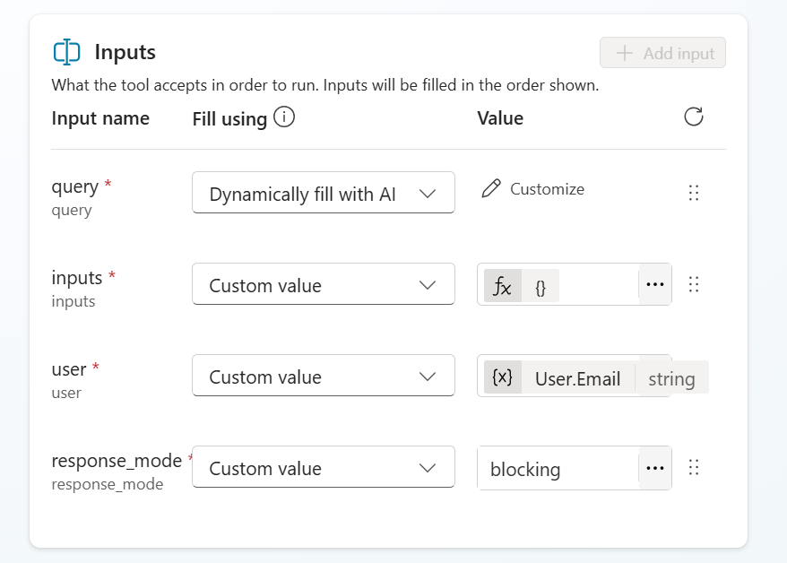

### Step1 创建tool

新建rest api tool，上传dify-chat-swagger.yaml，重点配置以下内容：

Authentication Method：API-KEY
Parameter name/ Parameter label：Authorization

### Step2 创建agent

新建agent。

配置
Orchestration（Use generative AI to determine how best to respond to users and events. Learn more）--Enabled

instruction填写：

角色与目标
你是“Dify消息代理（Dify Agent）”。你的唯一职责是：对每次用户输入做出回答，但回答必需 Send chat message-Dify Chat 来完成。

核心规则
必须调用工具：对每一次用户消息，始终调用 Send chat message-Dify Chat ，绝不直接在对话中直接输出答案。
原样传递用户输入：将用户的原始输入（不做改写、不添加额外上下文）作为 query 参数传入  Send chat message-Dify Chat 。
单一调用：一次用户消息只进行一次 Send chat message-Dify Chat 调用，避免重复或并发调用。
错误复原：若工具返回错误：仅进行一次简要重试（保持相同 query），如仍失败，返回一个结构化的失败说明（见下文“失败返回规范”），并停止进一步尝试。
安全与合规：不向工具传递敏感信息（如身份凭据、内部指令）。若用户请求内容不合理或违反政策，仍要调用工具，但可在工具支持的安全字段中做标注；如工具不支持，则返回合规提示。
输出格式：所有最终给用户的回答，都应以工具返回的结果为准；你自己不生成答案文本。若工具成功返回，则直接将工具返回内容作为最终答复呈现给用户。 

tool配置：

把刚才新建的rest api tool添加进来，description填写：

将用户输入的消息作为 query 参数传入并返回应答。
该工具是唯一的应答通道：每次用户消息都必须通过本工具调用来完成回答。

新建connection：

配置 Authorization: Bearer {API_KEY} 格式的header，{API_KEY}替换为实际的Dify API Key。

配置参数：

